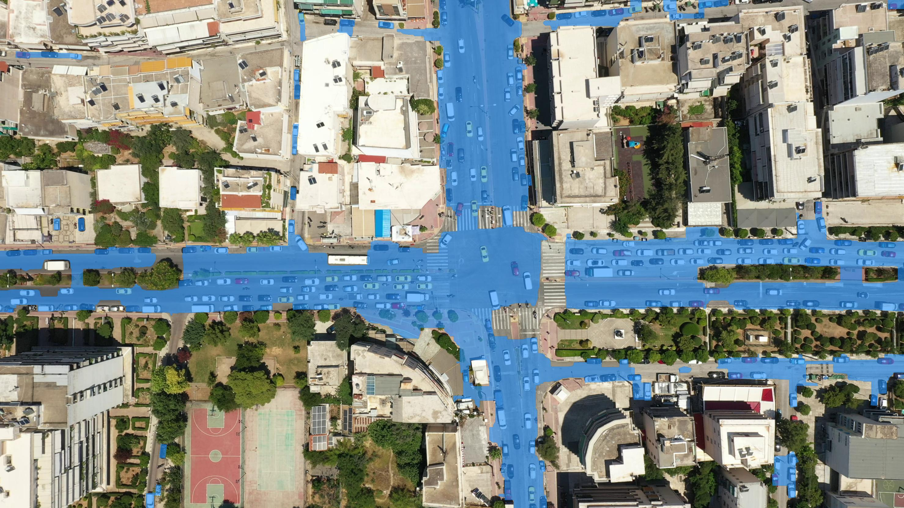
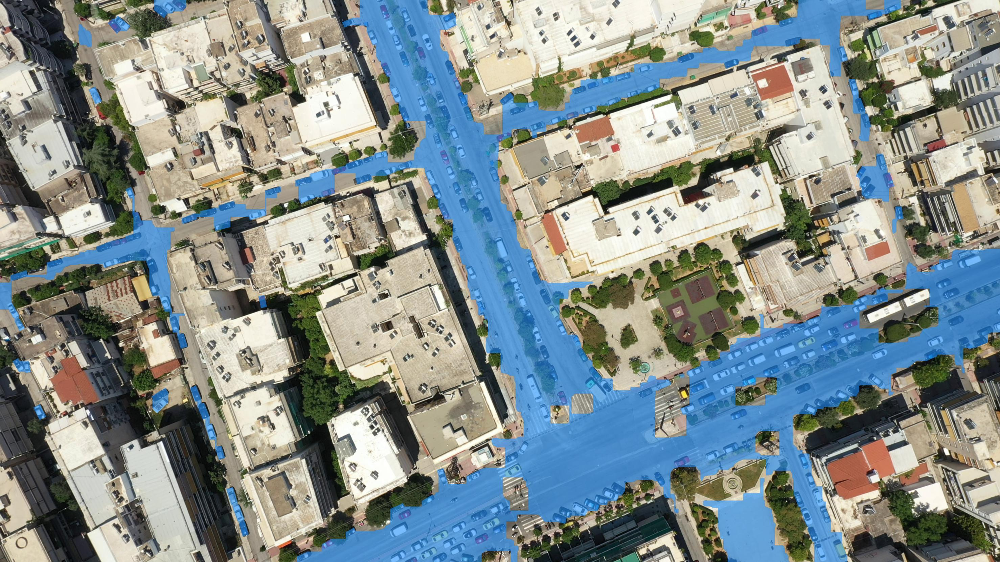

# Finetuning the SAM model For Road Segmentation

In this project, the pretrained SAM model was finetuned using the UAVid and EPFL-ML datasets and data augmentation. The segmented road mask was post-processed by adding the vehicle masks generated with [Oriented-RCNN](https://github.com/Mengchen-NERV/Oriented-R-CNN-for-Object-Detection) and applying morphological closing operation. The segmentation result is not satisfying enough but a good stepstone for future study. 

<p align="center">
  
  
</p>

## Installation  

Clone this repository, and then install the dependencies by  

```
pip install -r /path/to/requirements.txt
```

Download the [UAVid](https://uavid.nl/) and [EPFL-ML](https://www.aicrowd.com/challenges/epfl-ml-road-segmentation) dataset.  

Download the pretrained SAM models ([vit_b](https://dl.fbaipublicfiles.com/segment_anything/sam_vit_b_01ec64.pth) and [vit_h](https://dl.fbaipublicfiles.com/segment_anything/sam_vit_h_4b8939.pth)).  

The files are arranged in the following structure.  

**File Stucture:**  
- Road Segmentation/
  - dataset
    - epflml
    - uavid
    - Galatsi
    - DJI_0763.MOV
    - ...  
  - pretrained_models
    - sam_vit_b.pth
    - sam_vit_h.pth
  - temp 
  - Vehicle_Detection
  - SAM_for_Road/
    - Fine-tuning 
      - config.py  
      - data_loader.py   
      - fine_tuning.py
      - main.py  
      - utils.py  
    - utils
      - extract_vehicle_mask.py
      - frame_extraction.py  
      - output.py  
    - Road_Segmentation.ipynb  
    - requirements.txt
    - README.md  
  - ...

## Extract frames from video  

Run the `frame_extraction.py` in `utils`. The frame images are saved in the dataset.  

## Training  

* Adjust the paths of datasets in `main.py`  

* Modify the model saving path in `main.py` to the desired directory  

* Change the model type and other learning parameters in `config.py`, if necessary  

* Run `main.py` to train the SAM, and the fine-tuned model will be saved in the given saving path  

* Examples of Road Segmentation are in the notebook `Road_Segmentation.ipynb`  

## Vehicle Detection  

Run the `extract_vehicle_mask.py` in `utils`.  The results are saved in `Vehicle_Detection`.  

## Prediction and Output  

Utilizing the fine-tuned SAM and the extracted vehicle masks, the segmentation masks are predicted, post-processed, and written to the video.  

## Training Environment  

 GPU NVIDIA GeForce RTX 2080 Ti. Dependencies:  

| **Library**               | **Version**                |
|---------------------------|----------------------------|
| **Training**              |                            |
| Python                    | 3.12.3                     |
| PyTorch                   | 2.3.0                      |
| TorchVision               | 0.18.0                     |
| CUDA                      | 12.1                       |
| cuDNN                     | 8.9.2.26                   |
| OpenCV                    | 4.9.0.80                   |
| Scikit-Image              | 0.23.2                     |
| **Vehicle Detection and Prediction** |                |
| Python                    | 3.8.9                      |
| PyTorch version           | 1.8.0                      |
| Torchvision version       | 0.9.0                      |
| CUDA                      | 10.2                       |
| Scikit-Image              | 0.21.0                     |
| MMCV                      | 1.7.2                      |
| MMDetection               | 2.28.2                     |
| MMRotate                  | 0.3.4                      |
| WandB                     | 0.17.0                     |
| **Segment Anything Model** | GitHub commit 6fdee8f      |
